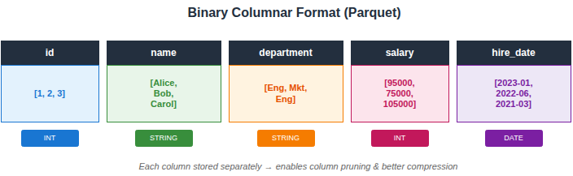
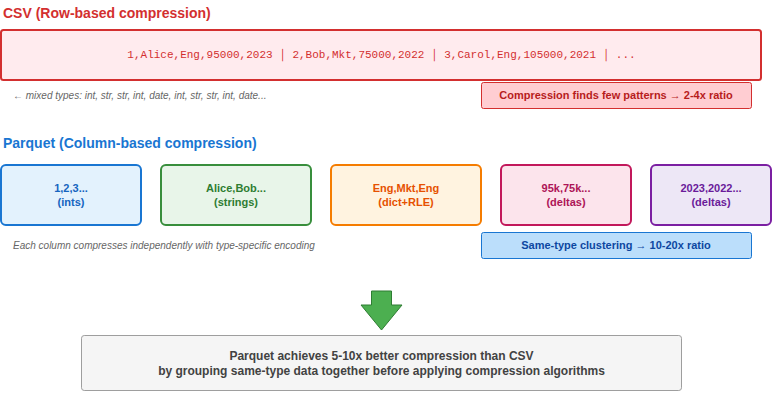
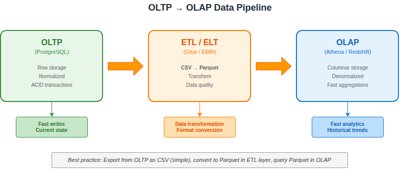

# OLTP vs OLAP: Understanding Data Storage Paradigms

What CSV actually is:

* An interchange/export format — a simple way to move data between systems
* Row-oriented text, which makes it easy to export from row-based OLTP databases

What OLTP systems actually use:

* PostgreSQL: heap files with TOAST, B-tree indexes
* MySQL InnoDB: clustered indexes, tablespaces
* Oracle: data blocks, extents, segments

## Overview

| Aspect                  | OLTP                          | OLAP                              |
| ----------------------- | ----------------------------- | --------------------------------- |
| **Full Name**     | Online Transaction Processing | Online Analytical Processing      |
| **Purpose**       | Day-to-day operations         | Business intelligence & analytics |
| **Operations**    | INSERT, UPDATE, DELETE        | SELECT (aggregations, joins)      |
| **Data Volume**   | Current transactions          | Historical data (TB to PB)        |
| **Query Pattern** | Many small, fast queries      | Few complex, long-running queries |
| **Users**         | Applications, end-users       | Analysts, data scientists         |
| **Examples**      | PostgreSQL, MySQL, DynamoDB   | Redshift, Athena, BigQuery        |

---

## File Formats: CSV vs Parquet

In the context of data lakes and analytics (OLAP), the choice of file format dramatically impacts **performance**, **cost**, and **usability**.

### CSV (Comma-Separated Values)

```
id,name,department,salary,hire_date
1,Alice,Engineering,95000,2023-01-15
2,Bob,Marketing,75000,2022-06-01
3,Carol,Engineering,105000,2021-03-20
```

**Row-based format** — data is stored row by row.

#### How CSV Compression Works

CSV can be compressed externally using gzip, bzip2, or similar:

```
data.csv  →  gzip  →  data.csv.gz
```

**Problem**: Row-based data mixes different data types together:

```
1,Alice,Engineering,95000,2023-01-15,2,Bob,Marketing,75000...
│  │     │           │     │          │ │   │         │
int str  str         int   date       int str str     int
```

Compression algorithms look for **repeating patterns**. When you mix `int`, `string`, `date` in sequence, there are fewer patterns to exploit. The algorithm sees:

```
"1,Alice,Engineering,95000,2023-01-15,2,Bob,Marketing..."
```

No obvious repetition → **poor compression ratio** (typically 2-4x).

---

### Parquet



**Column-based format** — data is stored column by column.

#### How Parquet Compression Works

Parquet stores each column separately, then applies **encoding + compression**:

```
department column: [Engineering, Marketing, Engineering, Engineering, Sales, Engineering...]
```

**Step 1: Dictionary Encoding**

Replace repeated values with integer codes:

```
Dictionary: {0: "Engineering", 1: "Marketing", 2: "Sales"}
Data:       [0, 1, 0, 0, 2, 0, 0, 0, 1, 0...]  ← much smaller!
```

**Step 2: Run-Length Encoding (RLE)**

Consecutive repeated values stored as (value, count):

```
[0, 0, 0, 0, 0, 1, 1, 0, 0, 0]  →  [(0,5), (1,2), (0,3)]
```

**Step 3: Bit Packing**

If dictionary has only 4 values, you need only 2 bits per entry (not 32):

```
4 values = 2 bits each → 16 values fit in 4 bytes (vs 64 bytes as strings)
```

**Step 4: Block Compression**

Finally, apply Snappy/ZSTD/GZIP on top:

```
Encoded column data  →  Snappy  →  Compressed block
```

#### Why Columnar Compresses Better

| Column Type    | Compression Opportunity                      |
| -------------- | -------------------------------------------- |
| `department` | Few unique values → Dictionary + RLE (100x) |
| `salary`     | Similar numbers → Delta encoding (10x)      |
| `hire_date`  | Sequential dates → Delta encoding (20x)     |
| `id`         | Sequential integers → Delta encoding (50x)  |

**Result**: 5-20x compression vs CSV, because same-type data clusters together.

#### Visual Comparison



---

## Comparison: CSV vs Parquet

| Aspect                          | CSV                   | Parquet                               |
| ------------------------------- | --------------------- | ------------------------------------- |
| **Format**                | Row-based, text       | Column-based, binary                  |
| **Human Readable**        | ✅ Yes                | ❌ No                                 |
| **Compression**           | Poor (text)           | Excellent (columnar + encoding)       |
| **Schema**                | None (inferred)       | Embedded in file                      |
| **Data Types**            | Everything is text    | Native types (int, float, date, etc.) |
| **Partial Read**          | Must read entire file | Read only needed columns              |
| **Write Speed**           | Fast (simple append)  | Slower (needs encoding)               |
| **Read Speed (full)**     | Moderate              | Fast                                  |
| **Read Speed (few cols)** | Slow (reads all)      | Very fast (column pruning)            |
| **Ecosystem**             | Universal             | Big data tools (Spark, Athena, etc.)  |

---

## Detailed Pros and Cons

### CSV

#### Pros

| Advantage                         | Explanation                                        |
| --------------------------------- | -------------------------------------------------- |
| **Universal compatibility** | Every tool, language, and spreadsheet can read CSV |
| **Human readable**          | Open in any text editor, debug easily              |
| **Simple to produce**       | Just concatenate strings with commas               |
| **Streaming friendly**      | Can append rows without rewriting the file         |
| **No special tools**        | `cat`, `head`, `grep` work directly          |
| **OLTP export friendly**    | Easy to export from transactional databases        |

#### Cons

| Disadvantage                    | Explanation                                                                    |
| ------------------------------- | ------------------------------------------------------------------------------ |
| **No schema enforcement** | Type errors discovered at read time                                            |
| **Poor compression**      | Text representation wastes space (e.g., "1000000" = 7 bytes vs 4 bytes as int) |
| **No column pruning**     | Must read entire row even if you need 1 column                                 |
| **Parsing overhead**      | CPU cost to parse text → native types                                         |
| **No nested data**        | Cannot represent arrays or structs natively                                    |
| **Encoding issues**       | UTF-8 vs Latin-1, delimiter conflicts, quote escaping                          |
| **Costly for OLAP**       | Athena/Redshift charge by data scanned — CSV scans everything                 |

---

### Parquet

#### Pros

| Advantage                       | Explanation                                                   |
| ------------------------------- | ------------------------------------------------------------- |
| **Column pruning**        | Read only the columns you need → faster queries, lower cost  |
| **Excellent compression** | Same data type together compresses well (10x smaller typical) |
| **Predicate pushdown**    | Skip row groups that don't match filters                      |
| **Embedded schema**       | Types are known; no inference errors                          |
| **Native data types**     | Integers, floats, dates, decimals stored efficiently          |
| **Nested data support**   | Arrays, maps, structs supported natively                      |
| **OLAP optimized**        | Designed for Spark, Athena, Redshift Spectrum, BigQuery       |
| **Cost efficient**        | Pay-per-scan services (Athena) scan less data                 |

#### Cons

| Disadvantage                      | Explanation                                   |
| --------------------------------- | --------------------------------------------- |
| **Not human readable**      | Binary format requires specialized tools      |
| **Write complexity**        | Needs libraries (PyArrow, fastparquet)        |
| **Immutable rows**          | Cannot update in place; must rewrite file     |
| **Overhead for small data** | Metadata overhead not worth it for <1MB files |
| **Learning curve**          | Teams need to understand columnar concepts    |
| **Not streamable**          | Footer contains metadata; can't append rows   |

---

## Cost Impact: Real-World Example

Scenario: Query 1 TB of data, selecting 2 columns out of 50.

| Format            | Data Scanned                     | Athena Cost ($5/TB) |
| ----------------- | -------------------------------- | ------------------- |
| **CSV**     | 1 TB (full scan)                 | $5.00               |
| **Parquet** | ~40 GB (2/50 cols + compression) | $0.20               |

**Parquet is 25x cheaper** for this query pattern.

---

## When to Use Each

### Use CSV When:

- **Exchanging data with non-technical users** (Excel, Google Sheets)
- **Small datasets** (<100 MB) where performance doesn't matter
- **One-time exports** from OLTP systems
- **Debugging** — need to visually inspect the data
- **Interoperability** — recipient system only accepts CSV
- **Streaming ingestion** — appending rows incrementally

### Use Parquet When:

- **Data lakes** (S3, ADLS, GCS) for analytics
- **Large datasets** (>100 MB, especially >1 GB)
- **Repeated queries** on the same data
- **Column-selective queries** (SELECT few columns from many)
- **Cost-sensitive environments** (Athena, BigQuery, Redshift Spectrum)
- **Schema enforcement** is important
- **Long-term storage** — compression saves money

---

## OLTP → OLAP Pipeline

Typical data flow from transactional systems to analytics:



**Best practice**: Export from OLTP as CSV (simple), convert to Parquet in ETL layer, query Parquet in OLAP.

---

## Quick Reference

| Question                     | Answer                                  |
| ---------------------------- | --------------------------------------- |
| Building a data lake?        | **Parquet**                       |
| Sending data to Excel users? | **CSV**                           |
| Storing in S3 for Athena?    | **Parquet**                       |
| Quick one-time export?       | **CSV**                           |
| Optimizing query costs?      | **Parquet**                       |
| Need to edit data manually?  | **CSV**                           |
| Storing ML training data?    | **Parquet**                       |
| API response logging?        | **CSV** (then convert to Parquet) |

---

## Summary

|                       | CSV                                       | Parquet                                  |
| --------------------- | ----------------------------------------- | ---------------------------------------- |
| **Best for**    | Interchange, small data, human inspection | Analytics, large data, cost optimization |
| **OLTP**        | ✅ Good export format                     | ❌ Overkill                              |
| **OLAP**        | ❌ Expensive, slow                        | ✅ Designed for this                     |
| **Compression** | 1x (baseline)                             | 5-10x smaller                            |
| **Query speed** | Baseline                                  | 10-100x faster (column pruning)          |

**Rule of thumb**: Start with CSV for simplicity, convert to Parquet when data grows or costs matter.
