# SageMaker Unified Studio - Machine Overheat ML Pipeline

End-to-end ML pipeline for predicting machine overheating, built and orchestrated entirely within **Amazon SageMaker Unified Studio**. The pipeline runs as a workflow that cleans data, engineers features, trains a model, registers it in the MLflow Model Registry, validates quality gates, and deploys a real-time inference endpoint.

## Architecture

```
SageMaker Unified Studio
├── Workflows (MWAA/Airflow)
│   └── machine_overheat_pipeline
│       ├── clean_data          → 06_clean_data.ipynb
│       ├── feature_engineering → 07_feature_engineering.ipynb
│       ├── train_model         → 09_mlflow_tracking.ipynb  ──→  MLflow App
│       ├── validate_model      → 11_validate_model.ipynb   ──→  MLflow Registry
│       └── deploy_endpoint     → 12_deploy_endpoint.ipynb  ──→  SageMaker Endpoint
│
├── MLflow App (machine-overheat-mlflow)
│   └── Experiment: machine-overheat
│       └── Run: logistic_regression_v1 (metrics, params, registered model)
│
├── SageMaker Endpoint (machine-overheat-endpoint)
│   └── Real-time inference (ml.t2.medium)
│
├── Files (shared project storage)
│   └── Notebooks
│
└── JupyterLab (interactive development)
```

Each workflow task uses `SageMakerNotebookOperator`, which provisions an `ml.m6i.xlarge` instance, runs the notebook via papermill, and terminates. Total pipeline time: ~20 minutes (5 tasks x ~3 min provisioning + execution, plus ~5 min endpoint deployment).

## Quick Start

### Prerequisites

Before starting, ensure you have:

1. **An AWS account** with permissions to create SageMaker resources
2. **A SageMaker AI domain** — if you don't have one, go to **Amazon SageMaker AI > Domains** in the AWS Console and click **"Set up for single user (Quick setup)"**. This creates a domain with a default user profile, execution role, and a default JupyterLab space. Wait ~3 minutes for the domain to reach "InService" status.
3. **A SageMaker Unified Studio project** — this is where you'll upload notebooks, create workflows, and connect MLflow. If you don't have one, open your [Unified Studio portal](https://docs.aws.amazon.com/sagemaker-unified-studio/latest/userguide/what-is-sagemaker-unified-studio.html) and create a new project.
4. **S3 data bucket with raw data uploaded** — the pipeline notebooks expect data at `s3://{bucket}/data/raw/machines.csv`. Run the setup notebooks (`01` through `04`) in JupyterLab to create the bucket and upload synthetic data before running the workflow.

> **Note:** Quick Setup also auto-creates a `DefaultMLFlowApp`. You can use it or create a dedicated one in Step 1.

### Step 1. Create the MLflow App (in SageMaker AI Studio)

> **Important:** You cannot create an MLflow App from Unified Studio. It must be created in **SageMaker AI Studio** (the classic Studio IDE) first, then connected to your Unified Studio project.

1. Open the **AWS Console** and navigate to **Amazon SageMaker AI > Domains**. You'll see your domains listed with their status.

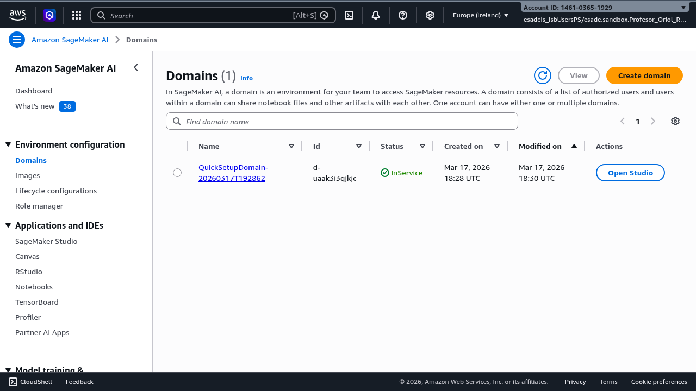

2. Click **"Open Studio"** next to your domain (e.g., `QuickSetupDomain-...`) to launch SageMaker AI Studio.
3. In Studio, click **MLflow** in the left sidebar.
4. Click **"Create MLflow App"**.

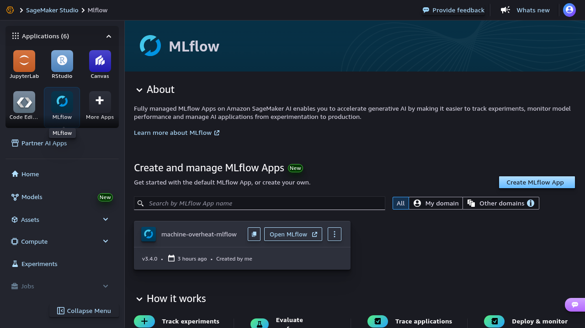

5. Fill in the creation form:
   - **Name**: e.g., `machine-overheat-mlflow` (letters, numbers, dashes only)
   - **Advanced settings** (expand to configure):
     - **IAM role**: Select your SageMaker execution role (pre-populated with domain default)
     - **Artifact storage location (S3 URI)**: e.g., `s3://sagemaker-eu-west-1-658203403846`

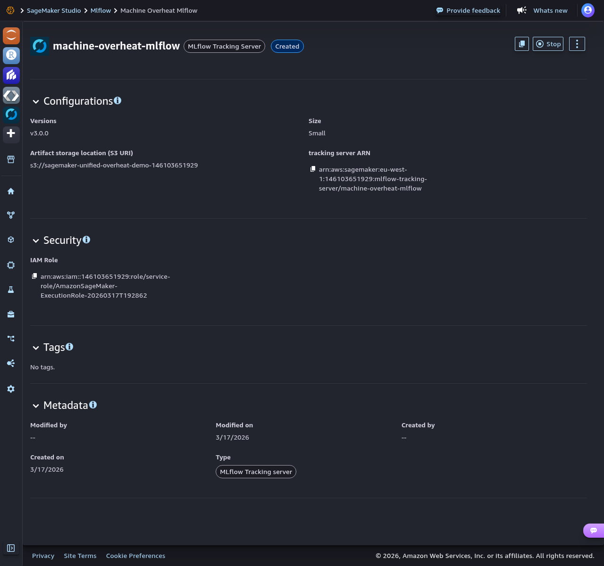

6. Click **Create** and wait ~5 minutes for the app to reach "Created" status
7. Copy the **MLflow App ARN** (format: `arn:aws:sagemaker:REGION:ACCOUNT:mlflow-app/APP_ID`)

### Step 2. Connect MLflow to your Unified Studio project

1. Open your project in SageMaker Unified Studio
2. Go to **MLflow** in the left sidebar (under AI/ML)

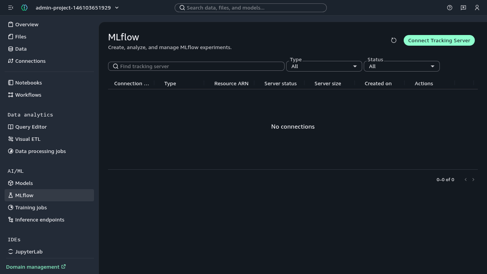

3. Click **"Connect Tracking Server"** (green button, top-right)

> **Re-deploy note:** If you previously connected an MLflow server that no longer exists (e.g., after cleanup), you must delete the stale connection first — click the **three-dot menu** (Actions) on the old entry and select **"Delete"**. Otherwise the new connection will fail with a 409 Conflict error.

4. Fill in:
   - **Connection name**: e.g., `machine-overheat-mlflow`
   - **MLflow Tracking Server ARN**: paste the ARN from Step 1

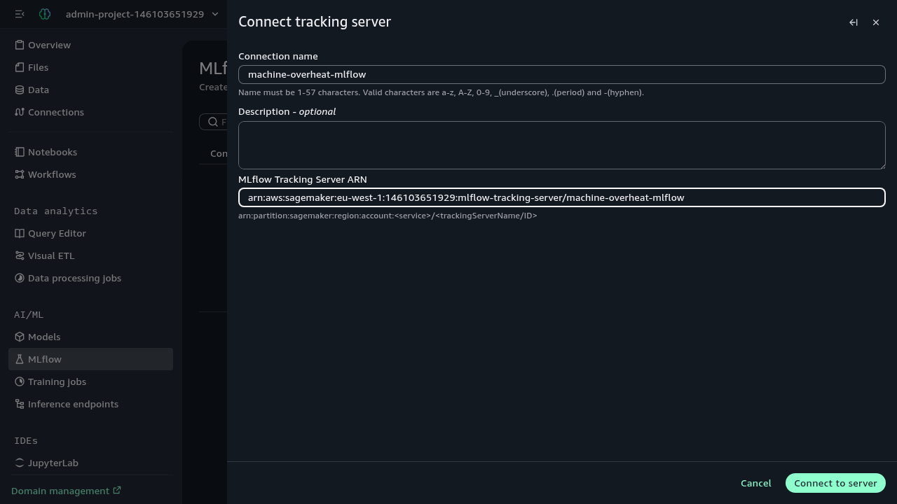

5. Click **"Connect to server"**
6. The server appears in the table with status "On". Click **"Open MLflow"** to verify.

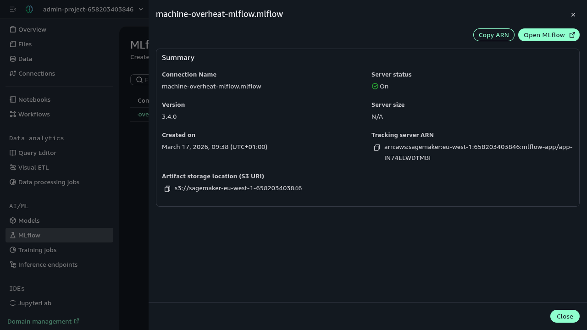

### Step 3. Upload notebooks

Go to **Files** in the left sidebar and upload the pipeline notebooks plus the endpoint test notebook:

- `06_clean_data.ipynb` — data cleaning
- `07_feature_engineering.ipynb` — feature creation
- `09_mlflow_tracking.ipynb` — model training, MLflow logging & registration
- `11_validate_model.ipynb` — model validation (accuracy, F1, distribution gates)
- `12_deploy_endpoint.ipynb` — endpoint deployment with smoke test
- `13_test_endpoint.ipynb` — manual endpoint testing (run in JupyterLab after workflow completes)

Once uploaded, the Files page should show the notebooks in the **Shared** folder:

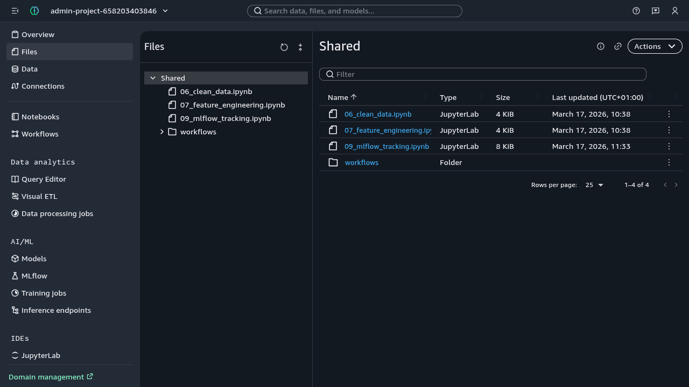

### Step 4. Create the workflow

Go to **Workflows** in the left sidebar, click **Create workflow**, and define three tasks in sequence.

> **Re-deploy note:** Workflow names persist even after deleting all SageMaker infrastructure. If `machine_overheat_pipeline` already exists from a prior deployment, choose a different name (e.g., `machine_overheat_pipeline_v2`). Remember to update the `dag_id` in the YAML to match.

The visual editor shows the DAG with each task as a `SageMakerNotebookOperator` node:

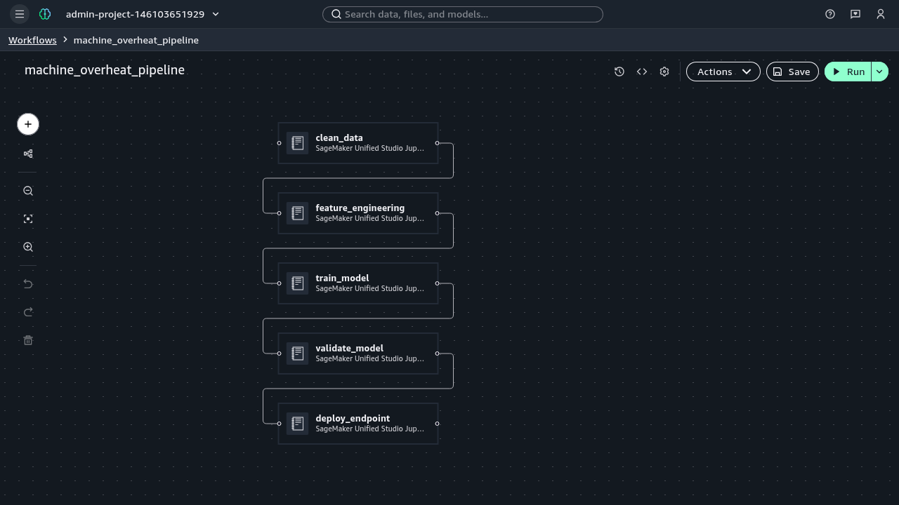

Click the **code icon** (`<>`) in the toolbar (top-right, next to the settings gear) to switch to **Code view**. Replace the YAML content with the configuration below — update the `mlflow_tracking_uri` value with your own MLflow App ARN:

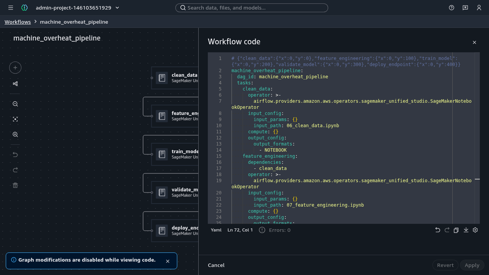

```yaml
machine_overheat_pipeline:
  dag_id: machine_overheat_pipeline
  tasks:
    clean_data:
      operator: >-
        airflow.providers.amazon.aws.operators.sagemaker_unified_studio.SageMakerNotebookOperator
      input_config:
        input_params: {}
        input_path: 06_clean_data.ipynb
      compute: {}
      output_config:
        output_formats:
          - NOTEBOOK
    feature_engineering:
      dependencies:
        - clean_data
      operator: >-
        airflow.providers.amazon.aws.operators.sagemaker_unified_studio.SageMakerNotebookOperator
      input_config:
        input_params: {}
        input_path: 07_feature_engineering.ipynb
      compute: {}
      output_config:
        output_formats:
          - NOTEBOOK
    train_model:
      dependencies:
        - feature_engineering
      operator: >-
        airflow.providers.amazon.aws.operators.sagemaker_unified_studio.SageMakerNotebookOperator
      input_config:
        input_params:
          mlflow_tracking_uri: "arn:aws:sagemaker:REGION:ACCOUNT:mlflow-app/YOUR_APP_ID"
        input_path: 09_mlflow_tracking.ipynb
      compute: {}
      output_config:
        output_formats:
          - NOTEBOOK
    validate_model:
      dependencies:
        - train_model
      operator: >-
        airflow.providers.amazon.aws.operators.sagemaker_unified_studio.SageMakerNotebookOperator
      input_config:
        input_params:
          mlflow_tracking_uri: "arn:aws:sagemaker:REGION:ACCOUNT:mlflow-app/YOUR_APP_ID"
          bucket_name: "YOUR_BUCKET_NAME"
        input_path: 11_validate_model.ipynb
      compute: {}
      output_config:
        output_formats:
          - NOTEBOOK
    deploy_endpoint:
      dependencies:
        - validate_model
      operator: >-
        airflow.providers.amazon.aws.operators.sagemaker_unified_studio.SageMakerNotebookOperator
      input_config:
        input_params:
          mlflow_tracking_uri: "arn:aws:sagemaker:REGION:ACCOUNT:mlflow-app/YOUR_APP_ID"
          endpoint_name: "machine-overheat-endpoint"
        input_path: 12_deploy_endpoint.ipynb
      compute: {}
      output_config:
        output_formats:
          - NOTEBOOK
  description: >-
    ML pipeline for machine overheat prediction: clean_data ->
    feature_engineering -> train_model -> validate_model -> deploy_endpoint
```

Click **Apply**, then **Save**.

### Step 5. Run and verify

1. Click the green **"Run"** button (top-right of the visual editor, visible in the screenshot above).
2. Click the **clock icon** in the toolbar (or navigate to the Runs panel) to monitor progress. The **Runs** tab shows all executions with status, duration, and timestamps (~25 min total for the full 5-task pipeline):

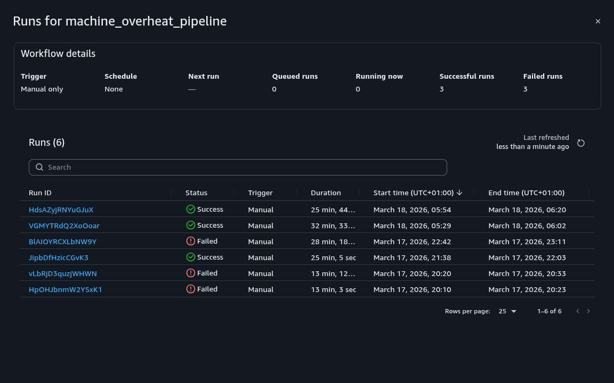

3. Click on a successful **Run ID** to see per-task details. All 5 tasks run as `SageMakerNotebookOperator` nodes (~3 min each, except deploy_endpoint which takes ~9 min for endpoint provisioning):

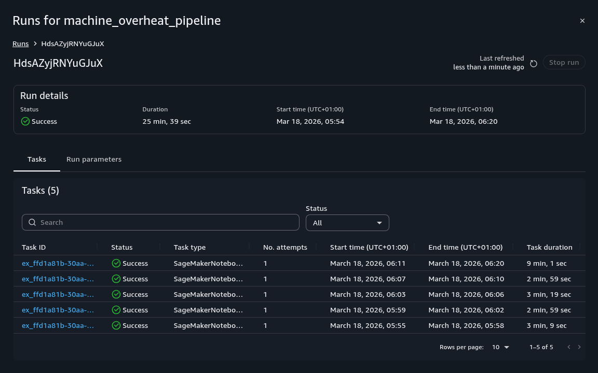

4. Go to **MLflow** in the left sidebar and click **"Open MLflow"** on the connected tracking server. The MLflow UI shows the `machine-overheat` experiment:

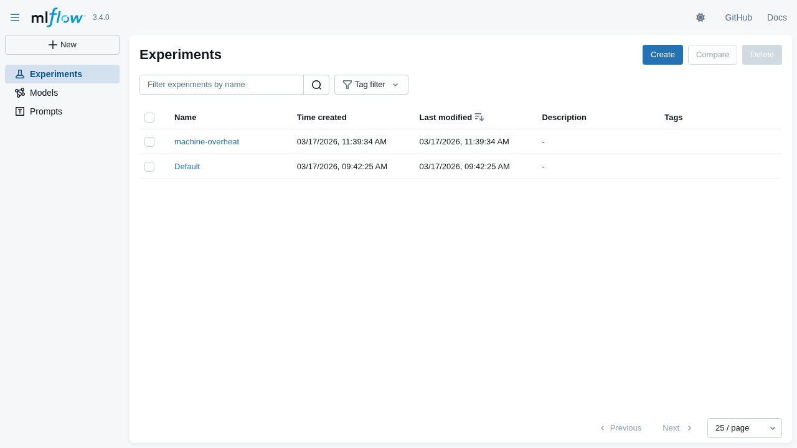

5. Click on the experiment, then on the run (e.g., `logistic_regression_v1`) to see metrics (accuracy, precision, recall, f1), parameters, and the registered model artifact:

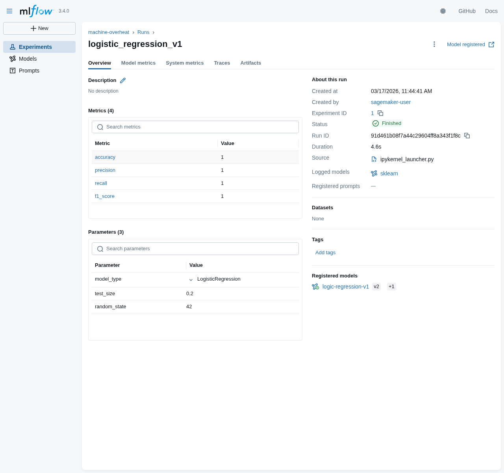

## MLflow Integration: How It Works

### The Problem

`MLFLOW_TRACKING_URI` is **not auto-injected** into the `SageMakerNotebookOperator` execution environment. Without explicit configuration, MLflow defaults to local file storage (`mlruns/`), and traces are lost when the compute instance terminates.

### The Solution

The MLflow App ARN is passed as a **papermill parameter** from the workflow YAML into the notebook.

**Workflow YAML** passes the ARN:
```yaml
input_params:
  mlflow_tracking_uri: "arn:aws:sagemaker:REGION:ACCOUNT:mlflow-app/YOUR_APP_ID"
```

**Notebook** receives it via a cell tagged `parameters` (papermill convention):
```python
# Parameters (injected by workflow via papermill)
mlflow_tracking_uri = "arn:aws:sagemaker:REGION:ACCOUNT:mlflow-app/YOUR_APP_ID"
```

Then uses it before any MLflow operation:
```python
mlflow.set_tracking_uri(mlflow_tracking_uri)
mlflow.set_experiment("machine-overheat")
```

### The sagemaker-mlflow Plugin Version Issue

The `SageMakerNotebookOperator` execution environment ships with `sagemaker-mlflow==0.1.x`, which only supports classic `mlflow-tracking-server` ARNs. Unified Studio MLflow Apps use the `mlflow-app` ARN format, which requires `sagemaker-mlflow>=0.2.0`.

| Plugin Version | `mlflow-tracking-server` ARN | `mlflow-app` ARN |
|---|---|---|
| 0.1.x (pre-installed) | Supported | **Not supported** (404 error) |
| **0.2.0+** | Supported | **Supported** |

The notebook must upgrade the plugin **before** importing mlflow:

```python
import subprocess, sys
subprocess.run(
    [sys.executable, "-m", "pip", "install", "sagemaker-mlflow>=0.2.0", "--quiet", "--upgrade"],
    capture_output=True, text=True
)
```

Without this, you get:
```
MlflowException: API request to endpoint /api/2.0/mlflow/experiments/get-by-name
failed with error code 404 != 200. Response body: 'Tracking server could not be found'
```

## Notebooks

### Pipeline Notebooks (used by the workflow)

| Notebook | Purpose | Input | Output |
|---|---|---|---|
| `06_clean_data.ipynb` | Remove nulls, convert types | `s3://bucket/data/raw/machines.csv` | `s3://bucket/data/processed/clean_machines.parquet` |
| `07_feature_engineering.ipynb` | Create `temp_diff`, `overheat` label | `s3://bucket/data/processed/clean_machines.parquet` | `s3://bucket/data/features/features.parquet` |
| `09_mlflow_tracking.ipynb` | Train, log to MLflow, register model | `s3://bucket/data/features/features.parquet` | MLflow run + registered model |
| `11_validate_model.ipynb` | Validate accuracy, F1, distribution | MLflow registry + `s3://bucket/data/features/` | Assert gates pass (fails workflow if not) |
| `12_deploy_endpoint.ipynb` | Deploy SageMaker real-time endpoint | MLflow registry (latest model) | SageMaker endpoint + smoke test |

### Setup & Exploration Notebooks (run manually in JupyterLab)

| Notebook | Purpose |
|---|---|
| `01_setup_env.ipynb` | Create `.env` with `BUCKET_NAME` and `REGION` |
| `02_create_s3_bucket.ipynb` | Create S3 bucket |
| `03_generate_data.ipynb` | Generate 216,000 synthetic temperature readings |
| `04_upload_to_s3.ipynb` | Upload `machines.csv` to S3 |
| `05_explore_data.ipynb` | Exploratory data analysis |
| `08_train_model.ipynb` | Basic training (no MLflow) |
| `10_model_registry.ipynb` | Register model in SageMaker Model Registry (alternative to MLflow registry) |

### Testing Notebooks (run manually after workflow completes)

| Notebook | Purpose |
|---|---|
| `13_test_endpoint.ipynb` | Test deployed endpoint with various scenarios (normal, overheat, borderline, batch) |

## Data Schema

**Input**: `machines.csv` (216,000 rows, 5 machines)

| Column | Type | Description |
|---|---|---|
| `timestamp` | datetime | Reading timestamp |
| `machine_id` | string | Machine ID (M1-M5) |
| `temperature` | float | Machine temperature (55-95 C) |
| `room_temp` | float | Ambient temperature (~25 C) |

**Engineered Features**:
- `temp_diff`: `temperature - room_temp`
- `overheat`: `1` if `temperature > 80`, else `0`

## Model

- **Algorithm**: Logistic Regression (scikit-learn)
- **Features**: `temperature`, `temp_diff`
- **Target**: `overheat` (binary classification)
- **Accuracy**: 100% on this dataset (clear threshold boundary)

## S3 Structure

```
s3://{bucket}/
├── data/
│   ├── raw/machines.csv
│   ├── processed/clean_machines.parquet
│   └── features/features.parquet
└── models/
    └── model.joblib
```

Workflow output notebooks are stored at:
```
s3://amazon-sagemaker-{account}-{region}-{project_id}/shared/workflows/output/
```

## Troubleshooting

| Problem | Cause | Fix |
|---|---|---|
| MLflow 404 "Tracking server could not be found" | `sagemaker-mlflow` plugin 0.1.x doesn't support `mlflow-app` ARN | Add `pip install sagemaker-mlflow>=0.2.0` cell before `import mlflow` |
| Notebook can't read S3 data | `BUCKET_NAME` env var not set in operator context | Use hardcoded fallback: `os.getenv('BUCKET_NAME', 'your-bucket')` |
| IAM AccessDeniedException on MLflow | Missing `CreatePresignedMlflowAppUrl` permission | Add `sagemaker:CreatePresignedMlflowAppUrl` to execution role |
| Can't create MLflow App in Unified Studio | Creation is only available in SageMaker AI Studio | Open SageMaker AI Studio > MLflow > Create MLflow App |
| 409 Conflict when connecting MLflow | Stale connection from a previous (deleted) MLflow App | Delete the old connection via Actions > Delete, then retry |
| Files page shows "NoSuchBucket" | The project's backing S3 bucket was deleted | Recreate the bucket: `aws s3 mb s3://amazon-sagemaker-{account}-{region}-{project_id}` |
| Workflow name already exists | Names persist across re-deployments (tied to DataZone project) | Use a different workflow name or delete the old workflow first |

## Unified Studio Components Used

| Component | Usage |
|---|---|
| JupyterLab | Interactive notebook development |
| Workflows | Orchestrated ML pipeline (5 tasks) |
| MLflow | Experiment tracking, model registry |
| Files | Shared project notebook storage |
| Inference Endpoint | Real-time predictions (`machine-overheat-endpoint`) |

## Cleanup

> **Warning:** Do **not** delete the project's backing S3 bucket (`s3://amazon-sagemaker-{account}-{region}-{project_id}`) — it is managed by Unified Studio and deleting it breaks the Files section. Only delete the data bucket you created.

```bash
# Delete MLflow App
aws sagemaker delete-mlflow-app --arn "arn:aws:sagemaker:REGION:ACCOUNT:mlflow-app/YOUR_APP_ID"

# Delete SageMaker domain (must delete user profiles first)
aws sagemaker delete-user-profile --domain-id DOMAIN_ID --user-profile-name USER_PROFILE --region REGION
aws sagemaker delete-domain --domain-id DOMAIN_ID --region REGION

# Delete endpoint (if deployed)
aws sagemaker delete-endpoint --endpoint-name machine-overheat-endpoint --region REGION

# Empty and delete data S3 bucket
aws s3 rm s3://$BUCKET --recursive --region REGION
aws s3 rb s3://$BUCKET --region REGION
```
