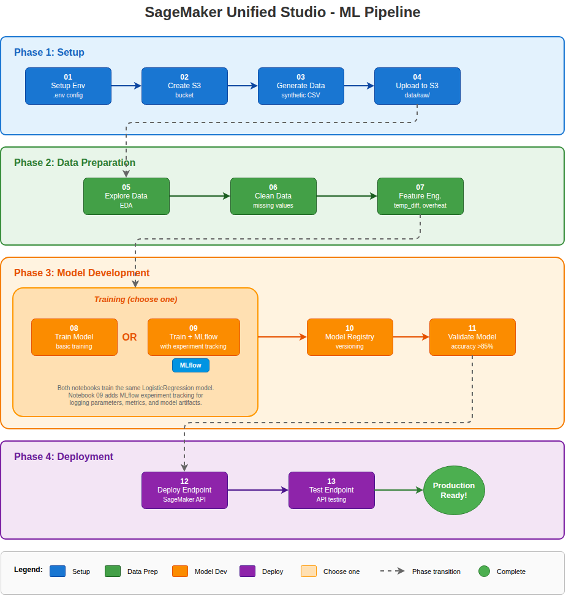

# SageMaker Unified Studio - ML Pipeline Notebooks

This repository contains 13 Jupyter notebooks that guide you through the complete machine learning lifecycle for predicting machine overheating.

## Pipeline Overview



## Notebooks Summary

### Phase 1: Setup

| Step | Notebook | Purpose | Key Actions |
|------|----------|---------|-------------|
| 1 | `01_setup_env.ipynb` | Environment Configuration | Creates `.env` file with `BUCKET_NAME` and `REGION` |
| 2 | `02_create_s3_bucket.ipynb` | AWS S3 Storage | Creates S3 bucket if not exists, verifies permissions |
| 3 | `03_generate_data.ipynb` | Synthetic Data Generation | Generates 216,000 temperature readings for 5 machines |
| 4 | `04_upload_to_s3.ipynb` | Upload to Cloud | Uploads `machines.csv` to `s3://{bucket}/data/raw/` |

### Phase 2: Data Preparation

| Step | Notebook | Purpose | Key Actions |
|------|----------|---------|-------------|
| 5 | `05_explore_data.ipynb` | Exploratory Data Analysis | Load from S3, visualize distributions, identify patterns |
| 6 | `06_clean_data.ipynb` | Data Cleaning | Handle missing values, convert types, save as Parquet |
| 7 | `07_feature_engineering.ipynb` | Feature Engineering | Create `temp_diff` feature, `overheat` target label |

### Phase 3: Model Development

| Step | Notebook | Purpose | Key Actions |
|------|----------|---------|-------------|
| 8 **OR** 9 | `08_train_model.ipynb` | Model Training (basic) | Train LogisticRegression, evaluate metrics, save model |
| 8 **OR** 9 | `09_mlflow_tracking.ipynb` | Model Training + MLflow | Same training with experiment tracking |
| 10 | `10_model_registry.ipynb` | Model Registry | Register model version for governance and lineage |
| 11 | `11_validate_model.ipynb` | Model Validation | Accuracy checks (>85% threshold), prediction distribution |

> **Note**: Notebooks 08 and 09 are **equivalent alternatives** - both train the same LogisticRegression model. The only difference is that notebook 09 includes MLflow experiment tracking (logging parameters, metrics, and model artifacts). **Choose one** based on whether you want to use MLflow.

### Phase 4: Deployment

| Step | Notebook | Purpose | Key Actions |
|------|----------|---------|-------------|
| 12 | `12_deploy_endpoint.ipynb` | Deploy Endpoint | Create SageMaker real-time inference endpoint |
| 13 | `13_test_endpoint.ipynb` | Test Endpoint | Test API with various scenarios, batch predictions |

## Quick Start

1. **Run notebooks in order** (Step 1 through Step 13)
2. Each notebook has prerequisites listed at the top
3. Ensure `.env` is created in Step 1 before proceeding

## Data Schema

**Input**: `machines.csv`
| Column | Type | Description |
|--------|------|-------------|
| `timestamp` | datetime | Reading timestamp |
| `machine_id` | string | Machine ID (M1-M5) |
| `temperature` | float | Machine temperature (55-95°C) |
| `room_temp` | float | Ambient temperature (~25°C) |

**Engineered Features**:
- `temp_diff`: `temperature - room_temp`
- `overheat`: `1` if `temperature > 80°C`, else `0`

## Model Details

- **Algorithm**: Logistic Regression (scikit-learn)
- **Features**: `temperature`, `temp_diff`
- **Target**: `overheat` (binary classification)
- **Expected Accuracy**: ~90-95%

## API Usage

After deployment, call the endpoint:

```python
import boto3
import json

runtime = boto3.client('sagemaker-runtime', region_name='eu-west-1')

response = runtime.invoke_endpoint(
    EndpointName='machine-overheat-endpoint',
    ContentType='application/json',
    Body=json.dumps({'temperature': 85, 'room_temp': 25})
)

result = json.loads(response['Body'].read().decode())
# {'prediction': 1, 'probability': 0.95}
```

## S3 Structure

```
s3://{bucket}/
├── data/
│   ├── raw/machines.csv
│   ├── processed/clean_machines.parquet
│   └── features/
│       ├── features.parquet
│       ├── test_features.parquet
│       └── test_labels.parquet
└── models/
    └── logistic_regression/
        ├── model.pkl
        └── model.tar.gz
```

## Cleanup

To avoid ongoing charges, delete resources when done:

```bash
# Delete endpoint
aws sagemaker delete-endpoint --endpoint-name machine-overheat-endpoint --region eu-west-1

# Empty and delete S3 bucket
aws s3 rm s3://$BUCKET --recursive --region eu-west-1
```

## SageMaker Unified Studio Components Used

| Component | Notebooks |
|-----------|-----------|
| JupyterLab | All |
| MLflow | 09 |
| Model Registry | 10 |
| Inference Endpoints | 12, 13 |
