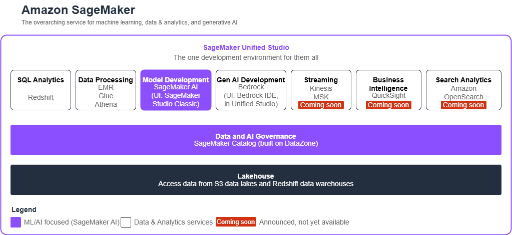

# Amazon SageMaker: Architecture Overview



## What is Amazon SageMaker?

**Amazon SageMaker** is AWS's overarching service for **machine learning, data & analytics, and generative AI**. As of March 2026, it encompasses two main environments:

| Environment | Focus | Target Users |
|-------------|-------|--------------|
| **SageMaker AI** (Studio Classic) | ML/AI Development | Data Scientists, ML Engineers |
| **SageMaker Unified Studio** | Full Data + Analytics + AI | All data/analytics/AI roles |

---

## SageMaker AI → SageMaker Studio (Classic)

**SageMaker AI** is the **ML-focused subset** within the broader SageMaker ecosystem. It provides the complete machine learning lifecycle:

### Core Capabilities

| Capability | Description |
|------------|-------------|
| **JupyterLab Notebooks** | Interactive development for data exploration and model prototyping |
| **Training Jobs** | Distributed training at scale with built-in or custom algorithms |
| **MLflow Integration** | Experiment tracking, metrics logging, model comparison |
| **Model Registry** | Centralized versioning, approval workflows, lineage tracking |
| **Inference Endpoints** | Real-time, batch, and serverless deployment options |
| **Model Monitoring** | Drift detection, data quality, and performance tracking |
| **AutoML (Autopilot)** | Automated model building for tabular data |

### Target Personas

- **Data Scientists**: Feature engineering, experimentation, model development
- **ML Engineers / MLOps**: Model deployment, CI/CD pipelines, monitoring, retraining

---

## SageMaker → SageMaker Unified Studio

**SageMaker Unified Studio** is the **superset** that integrates SageMaker AI with the full spectrum of AWS data and analytics services. Announced at re:Invent 2024, it provides **one development environment for all data, analytics, and AI workloads**.

### The Key Insight

> **SageMaker AI is a component *within* SageMaker Unified Studio.**
> Unified Studio adds SQL analytics, data processing, business intelligence, and more—unifying all data roles in a single interface.

### Integrated Services (March 2026)

| Category | Services | Status |
|----------|----------|--------|
| **SQL Analytics** | Amazon Redshift | Available |
| **Data Processing** | EMR, Glue, Athena | Available |
| **Model Development** | SageMaker AI (Studio Classic) | Available |
| **Gen AI Development** | Amazon Bedrock (Bedrock IDE) | Available |
| **Streaming** | Kinesis, MSK | Coming Soon |
| **Business Intelligence** | QuickSight | Coming Soon |
| **Search Analytics** | Amazon OpenSearch | Coming Soon |

### Foundation Layers

| Layer | Purpose |
|-------|---------|
| **Data and AI Governance** | SageMaker Catalog (built on DataZone) — unified discovery, access control, and lineage |
| **Lakehouse** | Single storage layer accessing S3 data lakes and Redshift data warehouses |

---

## Comparison: SageMaker AI vs Unified Studio

| Aspect | SageMaker AI (Studio Classic) | SageMaker Unified Studio |
|--------|-------------------------------|--------------------------|
| **Scope** | ML/AI only | Data + Analytics + AI |
| **Primary Focus** | Model development & deployment | Business analytics & full data lifecycle |
| **Services** | JupyterLab, Training, MLflow, Registry | All of SageMaker AI + Redshift, EMR, Glue, Athena, Bedrock, QuickSight... |
| **Users** | Data Scientists, ML Engineers | All data personas (see below) |
| **Governance** | Model Registry | Full Catalog (DataZone) with data + model governance |

---

## User Personas and Service Mapping

SageMaker Unified Studio is designed for **cross-functional collaboration**. Here's how each persona uses the platform:

| Persona | Primary Tools | Key Activities |
|---------|---------------|----------------|
| **Data Engineers** | Glue, EMR, Athena | ETL pipelines, data ingestion, data quality |
| **Data Analysts** | Athena, Redshift | SQL queries, exploratory analysis |
| **Business Analysts** | Redshift, QuickSight* | Dashboards, KPIs, business reporting |
| **Data Scientists** | SageMaker AI, JupyterLab, MLflow | Feature engineering, model experimentation |
| **ML Engineers / MLOps** | SageMaker AI, Model Registry | Deployment, monitoring, CI/CD for ML |
| **AI Application Developers** | Bedrock, SageMaker | Gen AI apps, RAG systems, prompt engineering |
| **Data Stewards** | SageMaker Catalog (DataZone) | Access control, compliance, lineage |

*Coming soon

---

## Example: End-to-End Workflow

Here's how different personas collaborate within Unified Studio:

```
1. Data Engineer     → Ingests raw data with Glue → Publishes to Catalog
2. Data Analyst      → Discovers data in Catalog → Validates with Athena SQL
3. Data Scientist    → Accesses same data in JupyterLab → Trains model with SageMaker
4. ML Engineer       → Deploys model to endpoint → Sets up monitoring
5. Business Analyst  → Queries predictions in Redshift → Creates QuickSight dashboard
```

All within **one unified interface** with **shared governance**.

---

## Summary

| | SageMaker AI | SageMaker Unified Studio |
|-|--------------|--------------------------|
| **What** | ML platform | Unified data + analytics + AI platform |
| **Relationship** | Subset | Superset (includes SageMaker AI) |
| **Focus** | ML/AI workflows | Business analytics + ML/AI |
| **Audience** | ML practitioners | All data roles |

**Bottom line**: If you're doing pure ML/AI, SageMaker AI (Studio Classic) has everything you need. If your organization needs to unify data engineering, analytics, BI, and ML in one governed environment, **SageMaker Unified Studio** is the answer.
