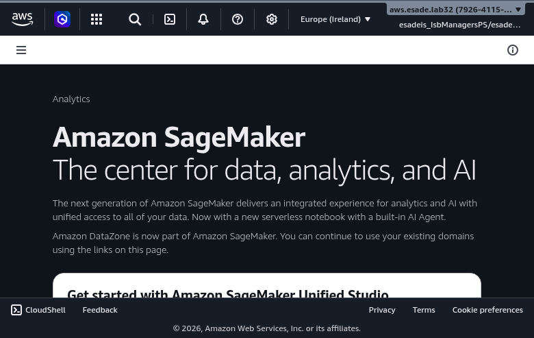
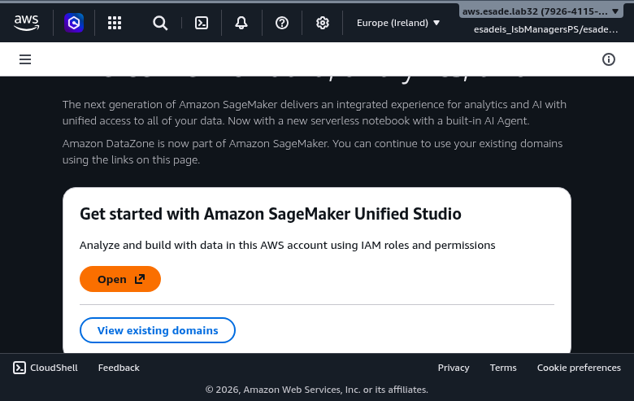
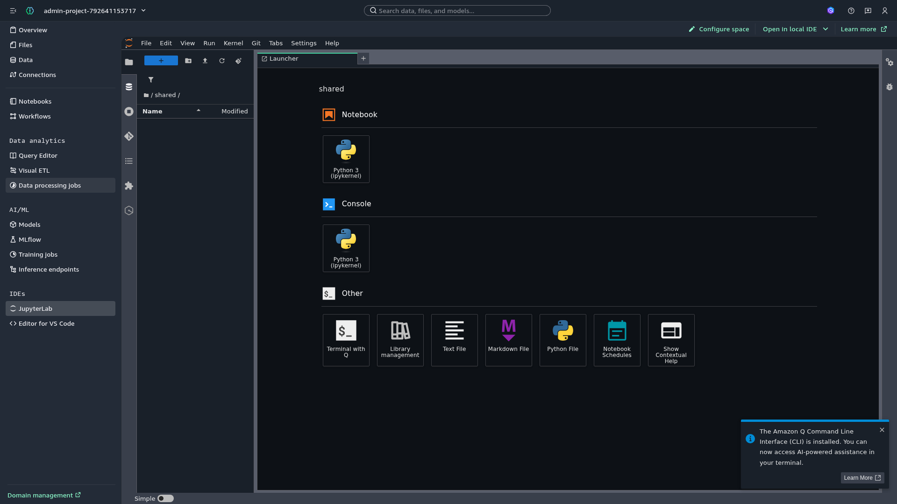
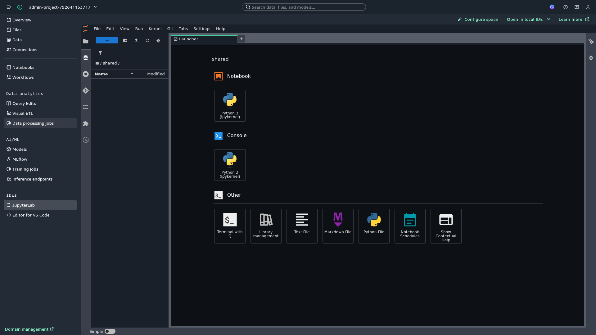
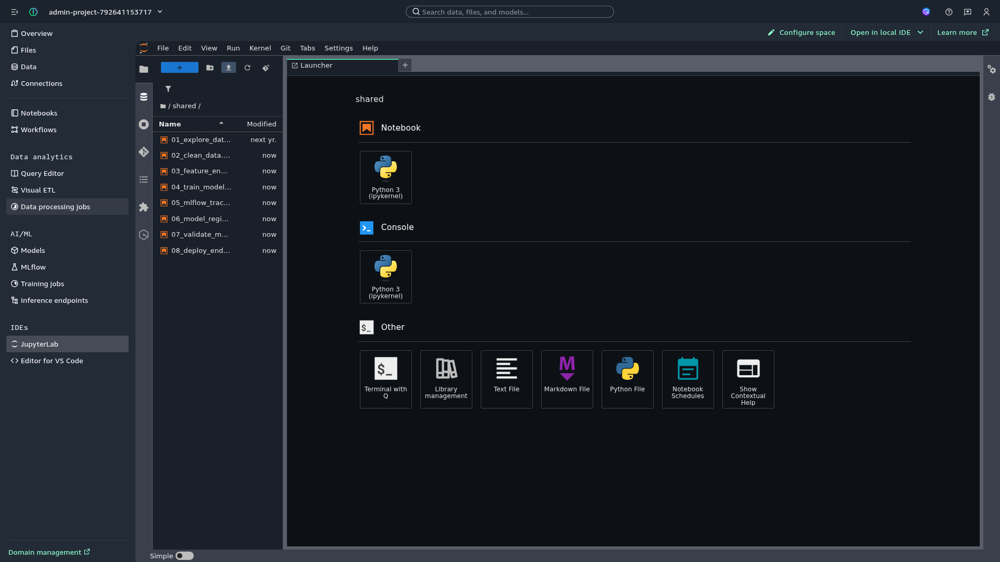

# Setup Guide: Deploying SageMaker Unified Studio

This guide walks through deploying the complete infrastructure for the machine overheat prediction demo.

> **Screenshots**: This guide includes screenshots to help you navigate the AWS Console. All screenshots are from the eu-west-1 region.

## Prerequisites Checklist

Before starting, ensure you have:

- [ ] AWS CLI installed and configured
- [ ] AWS credentials with appropriate permissions (Manager/Admin role)
- [ ] Python 3.11+ installed
- [ ] [uv](https://docs.astral.sh/uv/) installed

### Verify AWS CLI

```bash
aws --version
# Should show: aws-cli/2.x.x or higher

aws sts get-caller-identity
# Should show your AWS account ID and user ARN
```

### Required IAM Permissions

Your AWS user/role needs these permissions:

```json
{
  "Version": "2012-10-17",
  "Statement": [
    {
      "Effect": "Allow",
      "Action": [
        "datazone:*",
        "sagemaker:*",
        "s3:*",
        "iam:CreateRole",
        "iam:AttachRolePolicy",
        "iam:PassRole",
        "cloudformation:*",
        "glue:*",
        "lakeformation:*"
      ],
      "Resource": "*"
    }
  ]
}
```

## Step 1: Create SageMaker Unified Studio Domain (IAM-based)

SageMaker Unified Studio now supports **IAM-based domains** which are simpler to set up than Identity Center-based domains.

### 1.1 Navigate to Console

1. Go to https://eu-west-1.console.aws.amazon.com/datazone
2. Ensure region is set to **eu-west-1** (check the region selector in the top-right corner)

You should see the DataZone landing page:



### 1.2 Set Up IAM-based Domain

1. On the landing page, look for the **"Get started with Amazon SageMaker Unified Studio"** section
2. Click the **"Open"** button (or **"Set up"** if this is your first time)



3. If setting up for the first time, configure:
   - **Execution IAM role**: Select "Auto-create a new role with admin permissions" (recommended)
   - **S3 Tables integration**: Keep enabled (checkbox checked)
   - **Data encryption**: Use AWS owned key (default)
4. Click **"Set up"**

**Expected time**: 2-3 minutes for initial setup

### 1.3 Verify Domain Creation

After setup completes, a new browser tab opens with the Unified Studio portal.

```bash
# List domains via CLI
aws datazone list-domains --region eu-west-1
```

You should see a domain with `domainVersion: V2` and `status: AVAILABLE`.

## Step 2: Generate Synthetic Data

```bash
cd /path/to/sagemaker-unified-studio-demo

# Install dependencies
uv sync

# Generate data
uv run python scripts/generate_data.py
```

**Output**: `data/machines.csv` with **216,000 temperature readings** (5 machines × 30 days × 1,440 readings/day)

### Inspect the Data

```bash
head -n 5 data/machines.csv
```

Expected format:
```csv
timestamp,machine_id,temperature,room_temp
2026-02-03 00:00:00,M1,65.3,24.8
2026-02-03 00:01:00,M1,66.1,24.9
```

**Note**: The file is approximately 8-9 MB in size.

## Step 3: Deploy Project Resources

### 3.1 Create CloudFormation Stack

```bash
./deploy.sh
```

Or manually:

```bash
aws cloudformation create-stack \
  --stack-name sagemaker-overheat-project \
  --template-body file://cloudformation/project-resources.yaml \
  --capabilities CAPABILITY_IAM \
  --region eu-west-1

# Wait for completion
aws cloudformation wait stack-create-complete \
  --stack-name sagemaker-overheat-project \
  --region eu-west-1
```

**Expected time**: 2-3 minutes

### 3.2 Verify Stack Outputs

```bash
aws cloudformation describe-stacks \
  --stack-name sagemaker-overheat-project \
  --query 'Stacks[0].Outputs' \
  --output table \
  --region eu-west-1
```

Expected outputs:
- `DataBucketName`: S3 bucket name
- `ExecutionRoleArn`: IAM role ARN
- `Region`: eu-west-1

### 3.3 Upload Data to S3

```bash
uv run python scripts/upload_to_s3.py
```

Verify:
```bash
BUCKET=$(aws cloudformation describe-stacks \
  --stack-name sagemaker-overheat-project \
  --query 'Stacks[0].Outputs[?OutputKey==`DataBucketName`].OutputValue' \
  --output text \
  --region eu-west-1)

aws s3 ls s3://$BUCKET/data/raw/ --region eu-west-1
```

## Step 4: Access SageMaker Unified Studio

### 4.1 Open the Portal

1. Navigate to https://eu-west-1.console.aws.amazon.com/datazone
2. Click **"Open"** next to "Use your IAM based domain"
3. You'll be redirected to the Unified Studio portal

### 4.2 Navigate the Project

The IAM-based domain automatically creates an admin project. In the portal:
- **Overview**: Project dashboard
- **Files**: File browser
- **Data**: Data catalog and connections
- **Notebooks**: Jupyter notebooks
- **JupyterLab**: Full JupyterLab IDE (under IDEs section)
- **MLflow**: Experiment tracking
- **Models**: Model registry
- **Inference endpoints**: Deployed models

## Step 5: Access JupyterLab

### 5.1 Open JupyterLab

1. In the Unified Studio portal, look at the left sidebar
2. Click **JupyterLab** (under IDEs section)
3. Wait for JupyterLab to initialize (first time may take 1-2 minutes)



JupyterLab provides:
- Full Jupyter notebook environment
- File browser for managing notebooks
- Terminal access for shell commands
- Git integration
- Multiple kernels support

> **Important**: Always use the **Manager role** (esadeis_IsbManagersPS) when accessing AWS Console and SageMaker Unified Studio.

### 5.2 Upload Notebooks

Upload the pre-built notebooks from the `notebooks/` directory:

1. Click the **Upload Files** button in the JupyterLab toolbar
2. Navigate to the `notebooks/` folder from this project
3. Select all 8 notebooks (01_explore_data.ipynb through 08_deploy_endpoint.ipynb)
4. Click **Open** to upload



The notebooks will appear in the file browser. Double-click any notebook to open it.



### 5.3 Create .env Configuration File (CRITICAL)

> **IMPORTANT**: You MUST create this file before running any notebooks, or they will fail with "NoSuchBucket" errors.

The notebooks use `python-dotenv` to load configuration. Create a `.env` file in JupyterLab:

1. In JupyterLab, click **File** → **New** → **Text File**
2. A new `untitled.txt` file opens in the editor
3. Add the following content (replace `<account-id>` with your AWS account ID):

```bash
BUCKET_NAME=sagemaker-unified-overheat-demo-<account-id>
REGION=eu-west-1
```

Example with real account ID:
```bash
BUCKET_NAME=sagemaker-unified-overheat-demo-792641153717
REGION=eu-west-1
```

4. Save the file: **Ctrl+S** (or **Cmd+S** on Mac)
5. When prompted to rename, enter `.env` as the filename
6. Click **Rename and Save**

Alternatively, right-click on `untitled.txt` in the file browser and select **Rename**, then enter `.env`.

**Get your account ID** from the CloudFormation outputs:
```bash
aws cloudformation describe-stacks \
  --stack-name sagemaker-overheat-project \
  --query 'Stacks[0].Outputs[?OutputKey==`DataBucketName`].OutputValue' \
  --output text \
  --region eu-west-1
```

### 5.4 Verify Configuration

Open any notebook and run the first cell to verify the configuration works:

```python
from dotenv import load_dotenv
import os

load_dotenv()
bucket_name = os.getenv('BUCKET_NAME')
print(f"Using bucket: {bucket_name}")
```

Expected output:
```
Using bucket: sagemaker-unified-overheat-demo-792641153717
```

If you see `Using bucket: None`, the .env file is not configured correctly.

## Step 6: Register Data Connection

### 6.1 Add S3 Connection

1. In the portal, go to **Data** → **Connections**
2. Click **Add connection**
3. Select **Amazon S3**
4. Configure:
   - Name: `overheat-demo-data`
   - S3 URI: `s3://<your-bucket-name>/data/raw/`
   - Leave Access role ARN empty (uses default)
5. Click **Add**

### 6.2 Verify Connection

The S3 data should now be accessible from notebooks using the connection.

## Step 7: Note Your Configuration Values

The notebooks use your S3 bucket name to access data. Get these values from the CloudFormation stack outputs.

### 7.1 Get CloudFormation Stack Outputs

Run these commands to get your resource values:

```bash
# Get bucket name
aws cloudformation describe-stacks \
  --stack-name sagemaker-overheat-project \
  --query 'Stacks[0].Outputs[?OutputKey==`DataBucketName`].OutputValue' \
  --output text \
  --region eu-west-1

# Get execution role ARN
aws cloudformation describe-stacks \
  --stack-name sagemaker-overheat-project \
  --query 'Stacks[0].Outputs[?OutputKey==`ExecutionRoleArn`].OutputValue' \
  --output text \
  --region eu-west-1
```

### 7.2 Use Values in Notebooks

When copying code from the Student Guide, replace placeholders with your actual values:

```python
# Replace <account-id> with your AWS account ID
bucket_name = "sagemaker-unified-overheat-demo-<account-id>"

# Example with real account ID:
bucket_name = "sagemaker-unified-overheat-demo-792641153717"
```

### 7.3 Verify Configuration

Run this in a notebook cell to verify your S3 access:

```python
import boto3

bucket_name = "sagemaker-unified-overheat-demo-<account-id>"  # Replace with your bucket
s3 = boto3.client('s3')
response = s3.list_objects_v2(Bucket=bucket_name, Prefix='data/raw/')
for obj in response.get('Contents', []):
    print(f"Found: {obj['Key']} ({obj['Size']:,} bytes)")
```

You should see `data/raw/machines.csv` listed.

## Troubleshooting

### JupyterLab not starting

**Issue**: JupyterLab shows "Starting..." for a long time

**Solution**:
- Wait up to 2 minutes for the compute environment to initialize
- The kernel status shows "Idle" when ready
- Try refreshing the page if it takes longer

### JupyterLab shows validation error

**Issue**: JupyterLab shows "Validation error" or "space has failed to initialize"

**Solution**: This indicates domain environment corruption. Delete and recreate the domain:
1. Go to Domains page in DataZone console
2. Click Actions → Delete on the IAM-based domain
3. Confirm deletion
4. Set up a new domain

### "No environment found" error

**Issue**: Login shows "ValidationException - No environment found"

**Solution**: The domain may have broken environments. Delete and recreate the domain:
1. Go to Domains page in DataZone console
2. Click Actions → Delete on the IAM-based domain
3. Confirm deletion
4. Set up a new domain

### Data connection fails

**Issue**: Cannot access S3 data from notebooks

**Solution**:
- Verify the S3 bucket exists and has data
- Check IAM role permissions
- Try using direct S3 paths: `s3://<bucket>/data/raw/machines.csv`

### Kernel dies or restarts

**Issue**: Python kernel crashes when running notebooks

**Solution**:
- Check memory usage in the space configuration
- Restart the kernel: Kernel → Restart Kernel
- Try a larger instance type if available

## Next Steps

Once setup is complete, proceed to the [Student Guide](student-guide.md) to start working through the notebooks.

## Cleanup

### Delete Project Resources

```bash
# 1. Delete any running endpoints
aws sagemaker list-endpoints --region eu-west-1
aws sagemaker delete-endpoint \
  --endpoint-name machine-overheat-endpoint \
  --region eu-west-1

# 2. Empty S3 bucket
BUCKET=$(aws cloudformation describe-stacks \
  --stack-name sagemaker-overheat-project \
  --query 'Stacks[0].Outputs[?OutputKey==`DataBucketName`].OutputValue' \
  --output text \
  --region eu-west-1)

aws s3 rm s3://$BUCKET --recursive --region eu-west-1

# 3. Delete CloudFormation stack
aws cloudformation delete-stack \
  --stack-name sagemaker-overheat-project \
  --region eu-west-1

# 4. Delete domain (via console)
# Navigate to https://eu-west-1.console.aws.amazon.com/datazone
# Click Actions → Delete on the IAM-based domain
```

**Note**: Domain deletion takes 1-2 minutes.
