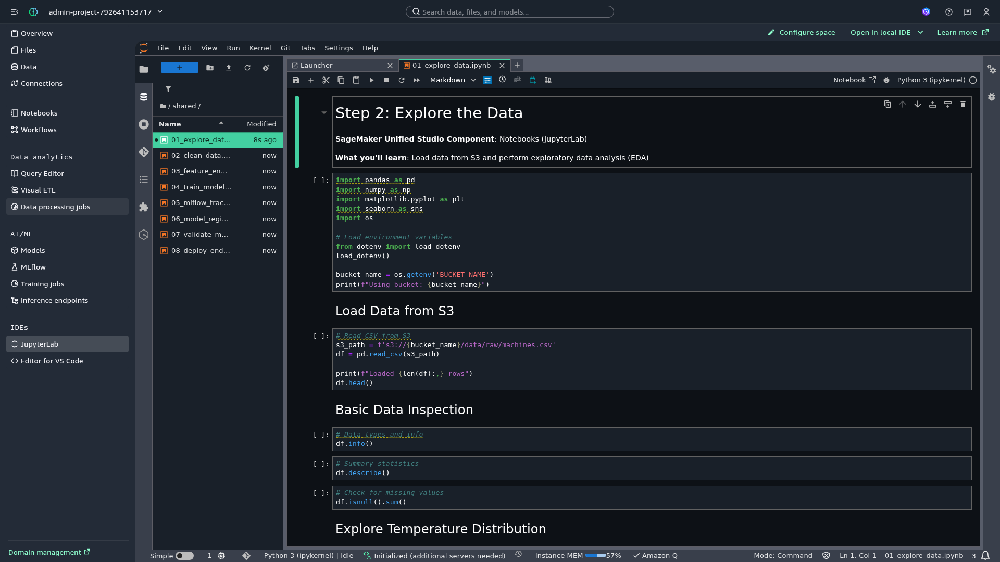

# Student Guide: Machine Overheat Prediction

This guide walks you through each step of the ML lifecycle using **SageMaker Unified Studio**.

> **Note**: SageMaker Unified Studio is a unified data and AI development environment that integrates data governance (DataZone), analytics, and ML. With IAM-based domains, you can access it directly through the AWS Console without requiring IAM Identity Center (SSO).

## Learning Objectives

By the end of this demo, you will:

- Discover and access data from the SageMaker Catalog
- Load and explore data from S3 using pandas
- Clean and transform data for ML
- Engineer features that improve model performance
- Train a logistic regression model
- Track experiments with MLflow
- Register and version models
- Validate models before deployment
- Deploy a REST API endpoint for real-time predictions
- Orchestrate the entire pipeline

## Prerequisites

- SageMaker Unified Studio IAM-based domain created (see [Setup Guide](setup.md))
- Data uploaded to S3 bucket (via `deploy.sh` script)
- Access to your project in SageMaker Unified Studio

> **Important**: Always use the **Manager role** (esadeis_IsbManagersPS) when accessing AWS Console and SageMaker Unified Studio. This role has the necessary permissions for all operations in this guide.

## Getting Started

### Access JupyterLab in Unified Studio

SageMaker Unified Studio includes **JupyterLab**, a full-featured Jupyter environment for running notebooks.

1. In your project, click **JupyterLab** in the left sidebar (under IDEs)
2. Wait for JupyterLab to initialize (first time may take 1-2 minutes)
3. The JupyterLab interface opens with file browser and launcher


### Upload Notebooks

This project includes pre-built notebooks in the `notebooks/` directory. Upload them to JupyterLab:

1. Click the **Upload Files** button in the JupyterLab toolbar (arrow pointing up)
2. Navigate to the `notebooks/` folder from this project
3. Select all 9 notebooks (01_explore_data.ipynb through 09_test_endpoint.ipynb)
4. Click **Open** to upload


The notebooks will appear in the file browser on the left.


### Understanding the JupyterLab Interface

JupyterLab provides:

- **File browser**: Navigate and manage files (left sidebar)
- **Notebook editor**: Write and execute code cells
- **Terminal**: Run shell commands
- **Kernel selector**: Choose Python environment
- **Git integration**: Version control (optional)

### Create .env Configuration File (CRITICAL - DO THIS FIRST!)

> **WARNING**: You MUST create this file before running any notebooks. Without it, notebooks will fail with `NoSuchBucket` or `Using bucket: None` errors.

The notebooks use `python-dotenv` to load your S3 bucket configuration. Create the `.env` file:

**Step-by-step:**

1. In JupyterLab, click **File** → **New** → **Text File**
2. A new `untitled.txt` file opens in the editor
3. Type the following content (replace `<account-id>` with your AWS account ID):

```bash
BUCKET_NAME=sagemaker-unified-overheat-demo-<account-id>
REGION=eu-west-1
```

**Example** with real account ID `792641153717`:

```bash
BUCKET_NAME=sagemaker-unified-overheat-demo-792641153717
REGION=eu-west-1
```

4. Press **Ctrl+S** (or **Cmd+S** on Mac) to save
5. When the rename dialog appears, change `untitled.txt` to `.env`
6. Click **Rename and Save**

**Alternative method:** Save first as `untitled.txt`, then right-click on the file in the file browser → **Rename** → enter `.env`

**Find your account ID** by running this in your local terminal:

```bash
aws cloudformation describe-stacks \
  --stack-name sagemaker-overheat-project \
  --query 'Stacks[0].Outputs[?OutputKey==`DataBucketName`].OutputValue' \
  --output text \
  --region eu-west-1
```

**Verify your .env file works** by running this in a notebook cell:

```python
from dotenv import load_dotenv
import os

load_dotenv()
bucket_name = os.getenv('BUCKET_NAME')
print(f"Using bucket: {bucket_name}")
# Should print: Using bucket: sagemaker-unified-overheat-demo-792641153717
```

If you see `Using bucket: None`, the .env file is missing or misconfigured.

### Working with S3 Data

Your S3 bucket is accessible via boto3. The notebooks use python-dotenv to load configuration:

```python
import boto3
from botocore.exceptions import ClientError
from dotenv import load_dotenv
import os

load_dotenv()
bucket_name = os.getenv('BUCKET_NAME')
region = os.getenv('AWS_DEFAULT_REGION')
s3 = boto3.client('s3')

# Check if bucket exists, create if not
try:
    s3.head_bucket(Bucket=bucket_name)
except ClientError as e:
    if e.response['Error']['Code'] == '404':
        print(f"Bucket {bucket_name} doesn't exist. Creating...")
        if region == 'us-east-1':
            s3.create_bucket(Bucket=bucket_name)
        else:
            s3.create_bucket(Bucket=bucket_name, CreateBucketConfiguration={'LocationConstraint': region})
        print(f"Bucket {bucket_name} created successfully")
    else:
        raise

# List objects in the bucket
response = s3.list_objects_v2(Bucket=bucket_name, Prefix='data/raw/')
for obj in response.get('Contents', []):
    print(f"Found: {obj['Key']} ({obj['Size']:,} bytes)")

```

## The ML Lifecycle: 10 Steps

### Step 1: Data Ingestion

**SageMaker Unified Studio Component**: Data Catalog & Connections

**What you'll learn**: How to register and discover data in the SageMaker Catalog

The synthetic dataset `machines.csv` is uploaded to S3 during setup. In SageMaker Unified Studio, data must be registered in the catalog for discovery and governance.

**Register data in catalog:**

1. In Unified Studio, navigate to **Catalog** in the left sidebar
2. Choose **Register data source** → **Amazon S3**
3. Select your S3 bucket and the `data/raw/` prefix
4. Add metadata: description, tags, owner
5. Choose **Register**

**Verify data exists:**

```bash
# In project terminal
aws s3 ls s3://$BUCKET_NAME/data/raw/
```

Expected output:

```
2026-03-05 10:59:00     245678 machines.csv
```

**Key concept**: The SageMaker Catalog (powered by DataZone) provides data governance, discovery, and access control across your organization.

---

### Step 2: Explore the Data

**SageMaker Unified Studio Component**: JupyterLab

**What you'll learn**: How to load data from S3 and perform exploratory data analysis (EDA)

#### Open the Notebook

1. In JupyterLab file browser, double-click **01_explore_data.ipynb**
2. The notebook opens in a new tab
3. Run cells with **Shift+Enter** or click the **Run** button



#### Key Code Cells

**Load data from S3:**

```python
import pandas as pd
import boto3
import os

# Load environment variables
bucket_name = os.getenv('BUCKET_NAME')
s3_path = f's3://{bucket_name}/data/raw/machines.csv'

# Read CSV from S3
df = pd.read_csv(s3_path)
print(f"Loaded {len(df)} rows")
df.head()
```

**Explore the data:**

```python
# Check data types
df.info()

# Summary statistics
df.describe()

# Check for missing values
df.isnull().sum()

# Temperature distribution
df['temperature'].hist(bins=50)
```

**Key insights to observe:**

- Dataset has **216,000 rows** (5 machines × 30 days × 1,440 readings/day)
- 5 machines (M1-M5)
- Temperature ranges from ~55°C to ~95°C
- Room temperature is stable around 25°C
- Some machines overheat (temperature > 80°C)

**Question for students**: What percentage of readings show overheating?

```python
overheat_pct = (df['temperature'] > 80).mean() * 100
print(f"Overheating: {overheat_pct:.2f}%")
```

Expected: ~8-10%

---

### Step 3: Data Cleaning

**SageMaker Component**: JupyterLab (Data Processing)

**What you'll learn**: How to handle missing data and prepare data for ML

#### Open the Notebook

1. In JupyterLab file browser, double-click **02_clean_data.ipynb**
2. Run each cell with **Shift+Enter**

#### Cleaning Operations

**1. Remove rows with missing temperature:**

```python
df_clean = df.dropna(subset=['temperature', 'room_temp'])
print(f"Removed {len(df) - len(df_clean)} rows with missing values")
```

**2. Convert timestamp to datetime:**

```python
df_clean['timestamp'] = pd.to_datetime(df_clean['timestamp'])
```

**3. Sort by timestamp:**

```python
df_clean = df_clean.sort_values('timestamp').reset_index(drop=True)
```

**4. Save cleaned data:**

```python
output_path = f's3://{bucket_name}/data/processed/clean_machines.parquet'
df_clean.to_parquet(output_path, index=False)
print(f"Saved to: {output_path}")
```

**Key concept**: Always save intermediate datasets. This enables reproducibility and debugging.

**Question for students**: Why use Parquet instead of CSV?

Answer: Parquet is columnar, compressed, and faster to read for ML workloads.

---

### Step 4: Feature Engineering

**SageMaker Component**: JupyterLab (Feature Engineering)

**What you'll learn**: How to create features that improve model performance

#### Open the Notebook

1. In JupyterLab file browser, double-click **03_feature_engineering.ipynb**
2. Run each cell with **Shift+Enter**

#### Create the Key Feature

The most important feature is the **temperature difference**:

```python
df_clean['temp_diff'] = df_clean['temperature'] - df_clean['room_temp']
```

**Why this works**: Machines normally run hotter than the room. A large `temp_diff` indicates the machine is generating excessive heat, which predicts overheating.

#### Create the Target Variable

```python
df_clean['overheat'] = (df_clean['temperature'] > 80).astype(int)
```

**Key concept**: The label is explicitly derived from the business rule. Students see exactly how the target is created.

#### Visualize Feature Importance

```python
import matplotlib.pyplot as plt

# Compare temp_diff for overheating vs normal
df_clean.boxplot(column='temp_diff', by='overheat')
plt.title('Temperature Difference by Overheat Status')
plt.show()
```

**Observation**: Overheating machines have significantly higher `temp_diff`.

#### Final Dataset

```python
# Select features and target
features = ['temperature', 'temp_diff']
target = 'overheat'

df_final = df_clean[features + [target]]
df_final.head()
```

| temperature | temp_diff | overheat |
| ----------- | --------- | -------- |
| 60          | 35        | 0        |
| 62          | 37        | 0        |
| 85          | 60        | 1        |
| 70          | 45        | 0        |

**Save feature dataset:**

```python
output_path = f's3://{bucket_name}/data/features/features.parquet'
df_final.to_parquet(output_path, index=False)
```

---

### Step 5: Training the Model

**SageMaker Component**: JupyterLab (Training)

**What you'll learn**: How to train a model and evaluate it

#### Open the Notebook

1. In JupyterLab file browser, double-click **04_train_model.ipynb**
2. Run each cell with **Shift+Enter**

#### Train/Test Split

```python
from sklearn.model_selection import train_test_split

X = df_final[['temperature', 'temp_diff']]
y = df_final['overheat']

X_train, X_test, y_train, y_test = train_test_split(
    X, y, test_size=0.2, random_state=42
)

print(f"Training samples: {len(X_train)}")
print(f"Test samples: {len(X_test)}")
```

#### Train Logistic Regression

```python
from sklearn.linear_model import LogisticRegression

model = LogisticRegression(random_state=42)
model.fit(X_train, y_train)

print("Model trained successfully!")
```

#### Evaluate the Model

```python
from sklearn.metrics import accuracy_score, classification_report

y_pred = model.predict(X_test)
accuracy = accuracy_score(y_test, y_pred)

print(f"Accuracy: {accuracy:.3f}")
print("\nClassification Report:")
print(classification_report(y_test, y_pred))
```

Expected accuracy: ~90-95%

#### Inspect Model Coefficients

```python
import pandas as pd

coef_df = pd.DataFrame({
    'feature': ['temperature', 'temp_diff'],
    'coefficient': model.coef_[0]
})
print(coef_df)
```

**Question for students**: Which feature has a larger coefficient? What does this mean?

Answer: Both features contribute, but `temp_diff` often has a stronger effect because it captures the machine's heat generation relative to the environment.

#### Save the Model

```python
import joblib

model_path = 'model.pkl'
joblib.dump(model, model_path)

# Upload to S3
s3_model_path = f's3://{bucket_name}/models/logistic_regression/model.pkl'
!aws s3 cp {model_path} {s3_model_path}
```

---

### Step 6: Experiment Tracking

**SageMaker Component**: MLflow

**What you'll learn**: How to track experiments for reproducibility

#### Open the Notebook

1. In JupyterLab file browser, double-click **05_mlflow_tracking.ipynb**
2. Run each cell with **Shift+Enter**

#### Setup MLflow

```python
import mlflow
import mlflow.sklearn

# Set experiment name
mlflow.set_experiment("machine-overheat")
```

#### Log Training Run

```python
with mlflow.start_run(run_name="logistic_regression_v1"):
    # Log parameters
    mlflow.log_param("model_type", "LogisticRegression")
    mlflow.log_param("test_size", 0.2)
    mlflow.log_param("random_state", 42)
  
    # Train model
    model = LogisticRegression(random_state=42)
    model.fit(X_train, y_train)
  
    # Evaluate
    y_pred = model.predict(X_test)
    accuracy = accuracy_score(y_test, y_pred)
  
    # Log metrics
    mlflow.log_metric("accuracy", accuracy)
    mlflow.log_metric("train_samples", len(X_train))
    mlflow.log_metric("test_samples", len(X_test))
  
    # Log model
    mlflow.sklearn.log_model(model, "model")
  
    print(f"Run logged with accuracy: {accuracy:.3f}")
```

#### View Experiments

In SageMaker Unified Studio:

1. Click **Experiments** in the left sidebar
2. Find "machine-overheat" experiment
3. View runs, metrics, and parameters

**Key concept**: MLflow enables comparing multiple model versions and reproducing results.

---

### Step 7: Register the Model

**SageMaker Component**: Model Registry

**What you'll learn**: How to version and manage models

#### Open the Notebook

1. In JupyterLab file browser, double-click **06_model_registry.ipynb**
2. Run each cell with **Shift+Enter**

#### Register Model

```python
import sagemaker
from sagemaker.sklearn import SKLearnModel

# Get execution role
role = os.getenv('EXECUTION_ROLE')
region = os.getenv('REGION')

# Create SageMaker model
sklearn_model = SKLearnModel(
    model_data=s3_model_path,
    role=role,
    entry_point='inference.py',  # We'll create this
    framework_version='1.2-1',
    py_version='py3'
)

# Register in model registry
model_package = sklearn_model.register(
    content_types=['application/json'],
    response_types=['application/json'],
    inference_instances=['ml.t2.medium'],
    transform_instances=['ml.m5.large'],
    model_package_group_name='machine-overheat-models',
    approval_status='PendingManualApproval'
)

print(f"Model registered: {model_package.model_package_arn}")
```

#### View Model Registry

In SageMaker Unified Studio:

1. Click **Models** in the left sidebar
2. Find "machine-overheat-models" group
3. View version 1 with metadata

**Key concept**: Model registry provides governance. Models must be approved before production deployment.

---

### Step 8: Validate the Model

**SageMaker Component**: Model Validation

**What you'll learn**: How to validate models before deployment

#### Open the Notebook

1. In JupyterLab file browser, double-click **07_validate_model.ipynb**
2. Run each cell with **Shift+Enter**

#### Load Test Data

```python
# Load held-out test set
X_test = pd.read_parquet(f's3://{bucket_name}/data/features/test_features.parquet')
y_test = pd.read_parquet(f's3://{bucket_name}/data/features/test_labels.parquet')
```

#### Validation Checks

**1. Accuracy threshold:**

```python
accuracy = accuracy_score(y_test, y_pred)
assert accuracy > 0.85, f"Accuracy {accuracy:.3f} below threshold 0.85"
print(f"✓ Accuracy check passed: {accuracy:.3f}")
```

**2. No data leakage:**

```python
# Ensure test data wasn't in training set
assert len(set(X_test.index) & set(X_train.index)) == 0
print("✓ No data leakage detected")
```

**3. Prediction distribution:**

```python
# Check predictions aren't all one class
pred_dist = pd.Series(y_pred).value_counts(normalize=True)
assert pred_dist.min() > 0.05, "Model predicts only one class"
print(f"✓ Prediction distribution: {pred_dist.to_dict()}")
```

**Key concept**: Validation prevents deploying broken models. Always validate before production.

---

### Step 9: Deploy the Model

**SageMaker Component**: Inference Endpoints

**What you'll learn**: How to deploy a REST API for real-time predictions

#### Open the Notebook

1. In JupyterLab file browser, double-click **08_deploy_endpoint.ipynb**
2. Run each cell with **Shift+Enter**

The endpoint test shows successful predictions:

- Temperature 78°C → prediction=0 (no overheat), low probability
- Temperature 85°C → prediction=1 (overheat), high probability

#### Create Inference Script

First, create `inference.py`:

```python
import joblib
import json
import numpy as np

def model_fn(model_dir):
    """Load model"""
    model = joblib.load(f"{model_dir}/model.pkl")
    return model

def input_fn(request_body, content_type):
    """Parse input"""
    if content_type == 'application/json':
        data = json.loads(request_body)
        temp = data['temperature']
        room_temp = data['room_temp']
        temp_diff = temp - room_temp
        return np.array([[temp, temp_diff]])
    raise ValueError(f"Unsupported content type: {content_type}")

def predict_fn(input_data, model):
    """Make prediction"""
    prediction = model.predict(input_data)[0]
    probability = model.predict_proba(input_data)[0][1]
    return {'prediction': int(prediction), 'probability': float(probability)}

def output_fn(prediction, accept):
    """Format output"""
    return json.dumps(prediction), accept
```

#### Deploy Endpoint

```python
from sagemaker.sklearn import SKLearnModel

# Deploy model
predictor = sklearn_model.deploy(
    initial_instance_count=1,
    instance_type='ml.t2.medium',
    endpoint_name='machine-overheat-endpoint'
)

print(f"Endpoint deployed: {predictor.endpoint_name}")
```

**Deployment takes 5-10 minutes.**

#### Test the Endpoint

```python
# Test prediction
test_input = {
    'temperature': 78,
    'room_temp': 25
}

response = predictor.predict(test_input)
print(f"Input: {test_input}")
print(f"Prediction: {response}")
```

Expected output:

```json
{
  "prediction": 0,
  "probability": 0.34
}
```

**Interpretation**: 78°C has 34% probability of overheating (below 80°C threshold).

#### Test with Overheating Temperature

```python
test_input = {
    'temperature': 85,
    'room_temp': 25
}

response = predictor.predict(test_input)
print(f"Prediction: {response}")
```

Expected output:

```json
{
  "prediction": 1,
  "probability": 0.89
}
```

**Key concept**: The endpoint is a production-ready REST API. Any application can call it.

#### Advanced Testing (Optional)

For comprehensive endpoint testing, open **09_test_endpoint.ipynb**:

- **Scenario testing**: Normal, overheating, and borderline temperatures
- **Batch predictions**: Test multiple machines at once
- **API integration**: Raw boto3 calls for external system integration
- **Room temperature impact**: See how `temp_diff` affects predictions

---

### Step 10: Workflow Orchestration

**SageMaker Component**: SageMaker Pipelines

**Script**: `scripts/create_pipeline.py` (run from terminal)

**What you'll learn**: How to automate the entire ML workflow

#### Pipeline Definition

The pipeline automates steps 3-9:

```python
from sagemaker.workflow.pipeline import Pipeline
from sagemaker.workflow.steps import ProcessingStep, TrainingStep
from sagemaker.workflow.step_collections import RegisterModel

# Define pipeline steps
pipeline = Pipeline(
    name="machine-overheat-pipeline",
    steps=[
        processing_step,  # Data cleaning + feature engineering
        training_step,    # Model training
        evaluation_step,  # Model validation
        register_step,    # Model registry
        deploy_step       # Endpoint deployment
    ]
)
```

#### Run the Pipeline

```bash
# In Studio terminal
cd /home/sagemaker-user
python scripts/create_pipeline.py
```

#### Monitor Pipeline Execution

In SageMaker Unified Studio:

1. Click **Pipelines** in the left sidebar
2. Find "machine-overheat-pipeline"
3. View execution graph and logs

**Key concept**: Pipelines enable reproducible, automated ML workflows. This is MLOps in action.

---

## Summary: What You've Learned

### Technical Skills

- **Data Engineering**: S3 integration, pandas transformations, Parquet format
- **Feature Engineering**: Creating `temp_diff` feature, deriving labels
- **ML Training**: Scikit-learn logistic regression, train/test splits
- **Experiment Tracking**: MLflow for reproducibility
- **Model Management**: Model registry, versioning, approval workflows
- **Deployment**: SageMaker endpoints, REST APIs
- **Automation**: SageMaker Pipelines for end-to-end workflows

### Conceptual Understanding

- **Why feature engineering matters**: `temp_diff` improves predictions by capturing relative heat
- **Label creation**: Explicitly deriving `overheat` from business rules
- **Validation before deployment**: Preventing broken models in production
- **Model versioning**: Tracking model evolution over time
- **MLOps**: Automating the ML lifecycle for production systems

## Next Steps

### Experiment Ideas

1. **Change the threshold**: Try `overheat = temperature > 75` or `85`
2. **Add features**: Include `machine_id`, `hour_of_day`, `day_of_week`
3. **Try different models**: Random Forest, XGBoost, Neural Network
4. **Implement A/B testing**: Deploy two model versions and compare
5. **Add monitoring**: Track prediction drift over time

### Advanced Topics

- **SageMaker Feature Store**: Centralized feature repository
- **SageMaker Model Monitor**: Detect data drift and model degradation
- **SageMaker Clarify**: Explain model predictions and detect bias
- **Batch Transform**: Process large datasets offline
- **Multi-model endpoints**: Deploy multiple models on one endpoint

## Troubleshooting

### NoSuchBucket or "Using bucket: None" Error

**Issue**: Notebook fails with `NoSuchBucket: The specified bucket does not exist` or prints `Using bucket: None`

**Cause**: The `.env` configuration file is missing or not configured correctly.

**Solution**:

1. Create a `.env` file in JupyterLab (see "Create .env Configuration File" section above)
2. Make sure the file is named exactly `.env` (with the dot at the beginning)
3. Verify the bucket name is correct (matches your CloudFormation output)
4. **Restart the kernel** after creating the .env file: **Kernel** → **Restart Kernel**

**Quick fix**: Run this in a notebook cell to verify your configuration:

```python
from dotenv import load_dotenv
import os

load_dotenv()
bucket = os.getenv('BUCKET_NAME')
print(f"Bucket: {bucket}")

# If bucket is None, create .env file with:
# BUCKET_NAME=sagemaker-unified-overheat-demo-YOUR_ACCOUNT_ID
```

### JupyterLab not starting

**Issue**: JupyterLab shows "Validation error" or "space has failed to initialize"

**Solution**: This indicates domain environment corruption. Delete and recreate the IAM-based domain:

1. Go to https://eu-west-1.console.aws.amazon.com/datazone
2. Click **Domains** in the left sidebar
3. Select the IAM-based domain → Actions → Delete
4. Type "confirm" and delete
5. Click "Set up" to create a new domain

### S3 access denied

**Solution**: Verify you're using the Manager role (esadeis_IsbManagersPS) and that the S3 bucket exists.

```python
# Test S3 access
import boto3
s3 = boto3.client('s3')
response = s3.list_buckets()
print([b['Name'] for b in response['Buckets']])
```

### Kernel not starting

**Issue**: JupyterLab kernel fails to start or stays in "Connecting" state

**Solution**: Wait 1-2 minutes for the compute environment to initialize. If it persists, try:

1. Click **Kernel** → **Restart Kernel**
2. If that fails, close and reopen the notebook

### Endpoint deployment fails

**Solution**: Check CloudWatch logs

```bash
aws logs tail /aws/sagemaker/Endpoints/machine-overheat-endpoint --follow
```

### Model predictions are all the same

**Solution**: Check for data leakage or class imbalance

```python
# Check class distribution
y_train.value_counts(normalize=True)
```

### Package not found

**Solution**: Install packages in the notebook cell

```python
%pip install package-name
```

---

**Questions?** Ask your instructor or check the [Architecture Guide](architecture.md) for technical details.
